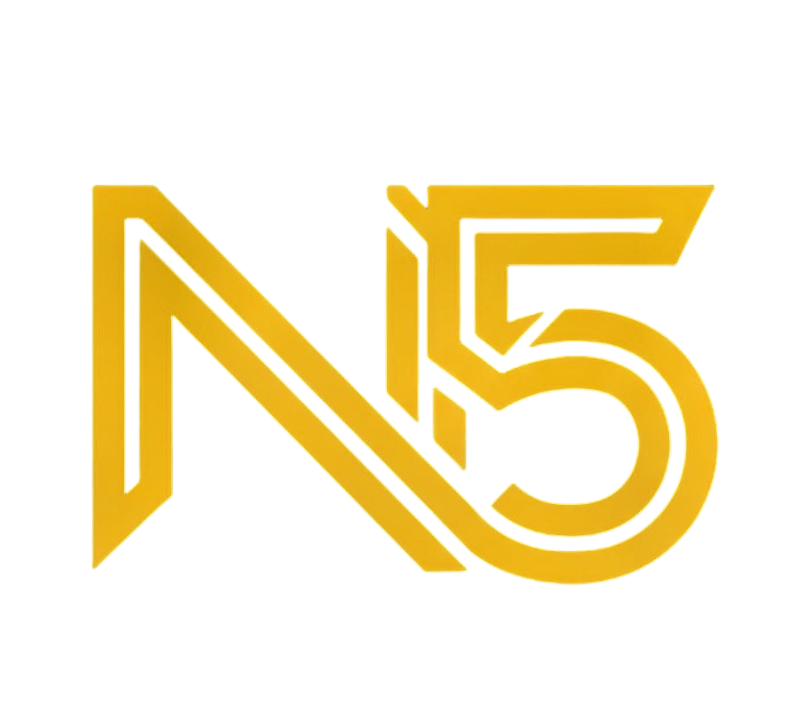

  

<h1 align="center">Nexus Five</h1>

<b>Your bridge between FiveM and Story Mode & More!</b>

  <a href="https://strp.cloud/N5">🌐 Website</a> •
  <a href="https://github.com/ARASAKA69/Nexus-Five/issues">Issues</a>

---

## 🚀 What is Nexus Five?

Nexus Five is the ultimate toolkit for GTA V modders, letting you effortlessly convert FiveM resources into standalone Story Mode DLC and multiplayer packs. Designed for both enthusiasts and advanced creators, Nexus Five bridges the gap between FiveM and single-player, unlocking a world of customization for your GTA V experience and offers many others usefull tools which makes your life much easier while Modding urself or installing any other Mod ⚡

---

## ✨ Key Features

- **FiveM to Single Player Converter:** Transform FiveM resources into standalone Story Mode DLC & MP packs.
- **Smart Auto-Detection:** Automatically identifies Maps, MLOs, Vehicles, and other content types.
- **Multi-Vehicle Pack Support:** Detects and merges multiple vehicles into single optimized DLC packs.
- **Map & MLO Conversion:** Convert buildings, interiors, and world objects with Addon DLC or MP Map support.
- **Vehicle Conversion:** Convert cars, bikes, boats, and aircraft with automatic meta file merging.
- **DLC List Editor:** Visual editor for `dlclist.xml` with search, add, edit, and remove functionality.
- **DLC Packs Browser:** Manage your DLC pack hierarchy with a file explorer interface.
- **DLC Comparison Tool:** Compare different DLC packs and analyze their contents (enable/disable as needed).
- **Batch DLC Installer:** Install multiple DLC packs at once with drag-and-drop support.
- **Batch DLC Cleanup:** Remove multiple DLC packs and update dlclist.xml automatically.
- **GTAV Enhanced Converter:** Convert legacy assets to Gen9/Enhanced format (YTD, YDR, YDD, YFT, YPT, RPF files).
- **Timecycle Editor:** Browse and edit timecycle XML files with live editing.
- **AddonSpawner List Generator:** Auto-generate UserDLC list files for AddonSpawner mod by ikt.
- **Modern Fluent UI:** Dark theme with golden accents and multiple color themes.
- **One-Click GTA V Launch:** Quick launch button for GTA V with custom executable support.
- **Built-in Help System:** Tutorials, FAQ, and community support integration.
- **Advanced Settings:** Configure paths, defaults, and interface preferences.
- **Progress Tracking:** Real-time conversion progress with detailed logging.
- **Search & Filter:** Live search functionality across DLC entries and packs.
- **Context Menus:** Right-click options for quick actions throughout the interface.
- **Future Plans:** Many more features planned, especially for Enhanced and FiveM players.

---

## 🛠️ Getting Started

1. Download Nexus Five from [The Website](https://strp.cloud/N5).
2. Start using it. simple right?

---

## 💻 Requirements

- Grand Theft Auto V (latest recommended, Enhanced/Gen9 support included)
- Windows 10/11
- .NET Framework (if applicable)
- FiveM resources for conversion (if you want to use the Converter)

---

## 💬 Community & Support

- [Website](https://strp.cloud/N5)
- [GitHub Issues](https://github.com/ARASAKA69/Nexus-Five/issues)
- [Telegram](https://t.me/nexus_five_news)
- [Discord](https://discord.gg/tzhXb7kP)
- [Patreon](https://www.patreon.com/posts/142032723?utm_campaign=postshare_creator&utm_content=android_share)
- [GTAInside](https://www.gtainside.de/gta5/tools/212261-nexus-five-your-bridge-between-fivem-and-story-mode-more)
- [GTA 5 MODS](https://www.gta5-mods.com/tools/nexus-five-your-bridge-between-fivem-and-story-mode-more)

---

## 🤝 Contributing

Suggestions, and feedback are welcome!  
Feel free to open an [issue](https://github.com/ARASAKA69/Nexus-Five/issues).

---

## 📄 License

This project is licensed under the [GNU GPL v3 License](LICENSE).

---

Thanks for your support and feedback! Made with ❤️ by ARASAKA69

